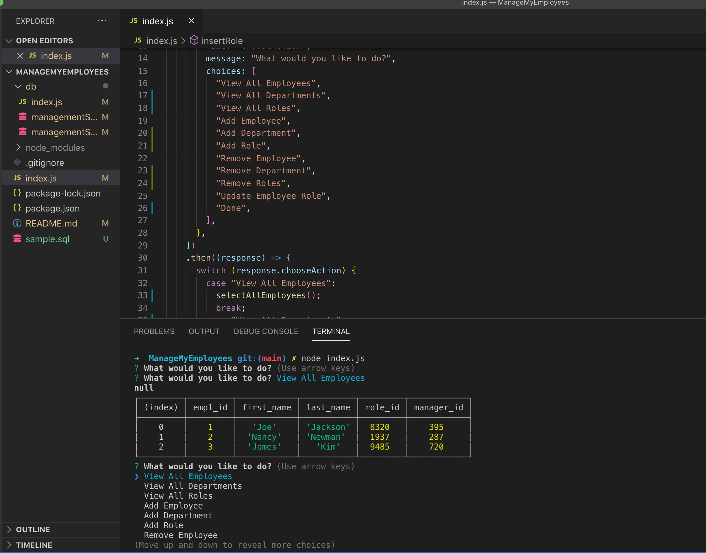

# ManageMyEmployees


## Description
This is an application that can access a database and view, add or update the contents.



## Table of Contents

  *[Installation](#installation)

  *[Usage](#usage)

  *[License](#license)

  *[Contribution](#contribution)

  *[Tests](#tests)

  *[Questions](#questions)

  ### Installation
  ```
npm i can be used to install dependencies such as inquirer for the questions 
  ```
 
  ### Usage
The intended use for this application was to create a database using mysql and javascript, then manipulate the database.  

  ### License
  This project is licensed under MIT.

  ### Contribution
  
  This is a demo application.

  ### Tests
  
 None at this time.

  ## Questions
  Please contact me, Theresa, with any questions you might have about this project.  You can reach me at bountravel@hotmail.com or view more of my work at GitHub, [tpidutti](https://github.com/tpidutti).

  ## Video Demo of Manage My Employees
  (https://youtu.be/n4MnKjVpK-w)
 